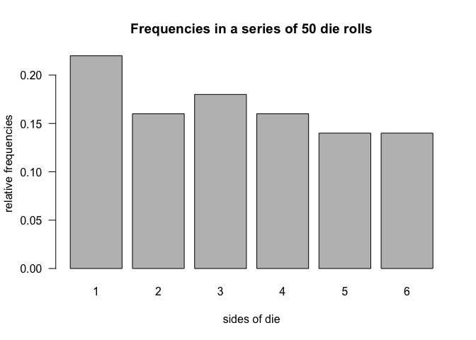
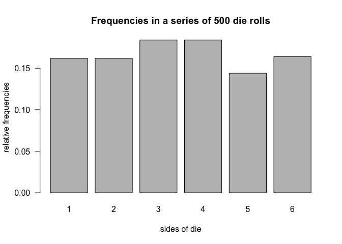
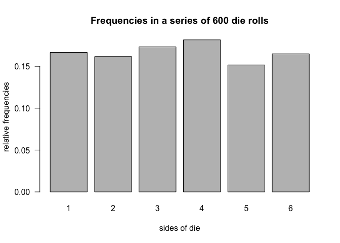

<!-- README.md is generated from README.Rmd. Please edit that file -->
Overview
--------

`"dieroller"` is a minimal [R](http://www.r-project.org/) package that provides functions to simulate rolling a die.

-   `die()` creates a die object (of class `"die"`)
-   `roll()` tosses a die object, producing a `"roll"` object.
-   `plot()` method for a `"roll"` object to plot frequencies of die rolls.
-   `summary()` method for a `"roll"` object.

Motivation
----------

This package has been developed to illustrate some of the concepts behind the creation of an R package.

Installation
------------

Install the development version from GitHub via the package `"devtools"`:

``` r
# development version from GitHub:
#install.packages("devtools") 

# install "dieroller" (without vignettes)
devtools::install_github("jonathansun5/dieroller")

# install "dieroller" (with vignettes)
devtools::install_github("jonathansun5/dieroller", build_vignettes = TRUE)
```

Usage
-----

``` r
library(dieroller)

# default die
die1 <- die()
die1
#> object "die"
#> 
#>   side      prob
#> 1    1 0.1666667
#> 2    2 0.1666667
#> 3    3 0.1666667
#> 4    4 0.1666667
#> 5    5 0.1666667
#> 6    6 0.1666667

# 1 roll of die1
roll(die1)
#> object "roll"
#> 
#> $rolls
#> 4

# 10 rolls of die1
roll10 <- roll(die1, times = 10)
roll10
#> object "roll"
#> 
#> $rolls
#> 3 5 6 5 5 1 6 1 5 4

# summary
summary(roll10)
#> summary "roll"
#> 
#>   side count prop
#> 1    1     2  0.2
#> 2    2     0  0.0
#> 3    3     1  0.1
#> 4    4     1  0.1
#> 5    5     4  0.4
#> 6    6     2  0.2


# 100 rolls
roll100 <- roll(die1, times = 100)

# summary
summary(roll100)
#> summary "roll"
#> 
#>   side count prop
#> 1    1    13 0.13
#> 2    2    16 0.16
#> 3    3    16 0.16
#> 4    4    21 0.21
#> 5    5    18 0.18
#> 6    6    16 0.16

# custom weighted die
str_die <- die(
  sides = c('a', 'b', 'c', 'd', 'e', 'f'),
  prob = c(0.075, 0.1, 0.125, 0.15, 0.20, 0.35))

# roll 20 times on a pseudo-fair die (remove `set.seed(123)` for different outputs)
set.seed(123)
str_rolls <- roll(str_die, times = 20)
str_rolls
#> object "roll"
#> 
#> $rolls
#> f c e b a f e b d e a e d d f b f f f a

# summary of custom weighted die
summary(str_rolls)
#> summary "roll"
#> 
#>   side count prop
#> 1    a     3 0.15
#> 2    b     3 0.15
#> 3    c     1 0.05
#> 4    d     3 0.15
#> 5    e     4 0.20
#> 6    f     6 0.30


# 50 rolls of a pseudo-fair die (remove `set.seed(123)` for different outputs)
fair_die <- die()
set.seed(123)
fair_50rolls <- roll(fair_die, times = 50)

#summary of 50 fair rolls
fair50_sum <- summary(fair_50rolls)
fair50_sum
#> summary "roll"
#> 
#>   side count prop
#> 1    1    11 0.22
#> 2    2     8 0.16
#> 3    3     9 0.18
#> 4    4     8 0.16
#> 5    5     7 0.14
#> 6    6     7 0.14

# plot method
plot(fair_50rolls)
```



``` r


# roll pseudo-fair die 500 times (remove `set.seed(123)` for different outputs)
set.seed(123)
fair_die <- die()
fair500 <- roll(fair_die, times = 500)

# summary method
summary(fair500)
#> summary "roll"
#> 
#>   side count  prop
#> 1    1    80 0.160
#> 2    2    81 0.162
#> 3    3    92 0.184
#> 4    4    92 0.184
#> 5    5    72 0.144
#> 6    6    83 0.166

# extracting roll in position 500
fair500[500]
#> [1] 6

# replacing last roll with "1"
fair500[500] <- 1
fair500[500]
#> [1] 1

# new summary with the modified roll
summary(fair500)
#> summary "roll"
#> 
#>   side count  prop
#> 1    1    81 0.162
#> 2    2    81 0.162
#> 3    3    92 0.184
#> 4    4    92 0.184
#> 5    5    72 0.144
#> 6    6    82 0.164

# plot method
plot(fair500)
```



``` r

# adding 100 rolls
fair600 <- fair500 + 100

# new summary with the modified roll plus 100 more rolls
summary(fair600)
#> summary "roll"
#> 
#>   side count      prop
#> 1    1   100 0.1666667
#> 2    2    97 0.1616667
#> 3    3   104 0.1733333
#> 4    4   109 0.1816667
#> 5    5    91 0.1516667
#> 6    6    99 0.1650000

# plot method
plot(fair600)
```


